

# מדריך קצר לניהול האתר

המדריך הזה מסביר איך עושים את הדברים של כל יום באתר ההזמנות: כניסה, זמן פנוי בכל יום, הזמנות, עוגות בעיצוב אישי ורשימת משלוחים. הכול עובד מהטלפון.

התמונות צולמו באתר ניסיון עם הזמנות מומצאות. השמות והמספרים בהן לא אמיתיים. במקום שכתוב בו <bdi>[שם העסק]</bdi> יופיע השם של העסק, כשנקבל אותו ממך.

**מה יש כאן**

1. [כניסה עם הקוד מהטלפון](#1-כניסה-עם-הקוד-מהטלפון)
2. [הוספת מוצר](#2-הוספת-מוצר)
3. [כמה זמן יש לי ביום מסוים](#3-כמה-זמן-יש-לי-ביום-מסוים)
4. [השבוע הרגיל שלי](#4-השבוע-הרגיל-שלי)
5. [הזמנות: התשלום הגיע, והודעה בוואטסאפ](#5-הזמנות-התשלום-הגיע-והודעה-בוואטסאפ)
6. [בקשה לעוגה בעיצוב אישי](#6-בקשה-לעוגה-בעיצוב-אישי)
7. [רשימת המשלוחים והדפסה שלה](#7-רשימת-המשלוחים-והדפסה-שלה)
8. [כשמשהו לא עובד](#8-כשמשהו-לא-עובד)

---

## 1. כניסה עם הקוד מהטלפון

פותחים בטלפון את הכתובת של האתר, ומוסיפים בסוף שלה את המילה הזאת:

<code>/admin</code>

כדאי לשמור את הדף הזה במועדפים או על מסך הבית של הטלפון.

1. מקלידים את האימייל והסיסמה שלך ולוחצים **כניסה**.
2. פותחים בטלפון את אפליקציית האימות (למשל Google Authenticator). יש בה מספר בן 6 ספרות שמתחלף כל 30 שניות.
3. מקלידים את 6 הספרות ולוחצים **אישור**.

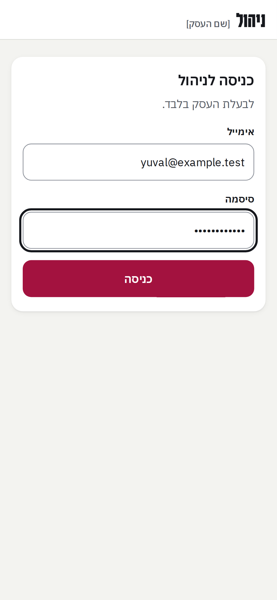 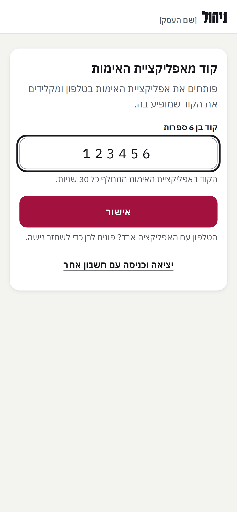

טוב לדעת:

- את הקוד מקלידים כל פעם שנכנסים. זה מה ששומר שרק את יכולה להיכנס, גם אם מישהו ידע את הסיסמה.
- אחרי 12 שעות האתר מבקש להיכנס שוב. זה בכוונה.
- בפעם הראשונה בלבד מחברים את האפליקציה לאתר: סורקים קוד מרובע שמופיע במסך. את זה נעשה יחד עם רן.
- אם הטלפון עם האפליקציה אבד, לא מנסים לבד: פונים לרן והוא יחזיר לך את הגישה.

## 2. הוספת מוצר

בלשונית **מוצרים** רואים את כל המוצרים. ליד כל מוצר כתוב אם הוא **מפורסם** (הלקוחות רואים אותו) או **לא מפורסם**.

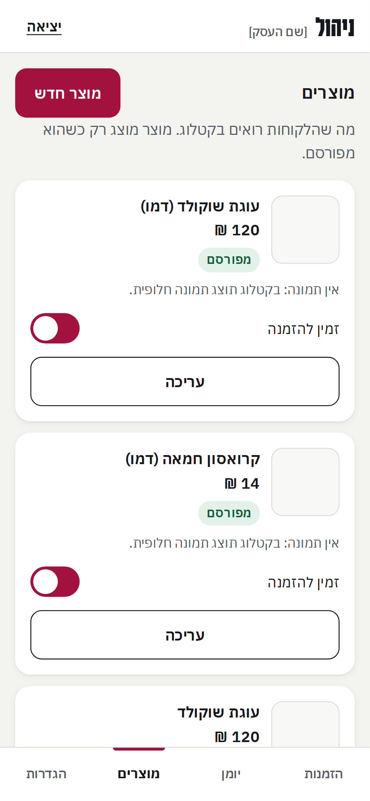

כדי להוסיף מוצר לוחצים **מוצר חדש** וממלאים:

- **שם המוצר**, ואם רוצים גם **תיאור**.
- **מחיר**: מה שהלקוח משלם, בשקלים.
- **נמכר בתור**: יחידה (קרואסון אחד) או אצווה (קופסה, עוגה שלמה).
- **דקות תנור** ו**דקות עבודה** לכל פריט שמזמינים. מהן יורד הזמן של היום.
- **רכיבים**, ומה המוצר **מכיל** ומה הוא **עלול להכיל**.
- מסמנים **בדקתי את הרכיבים והאלרגנים והם נכונים**.

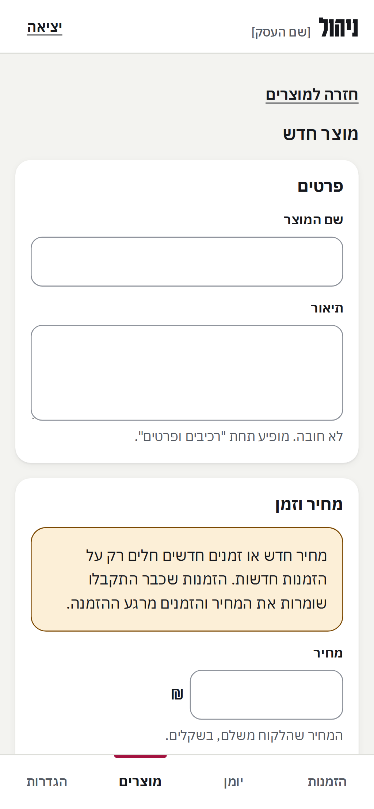

לוחצים **יצירת המוצר**, ואז מוסיפים תמונה. לכל תמונה כותבים **תיאור התמונה**: משפט קצר על מה שרואים בה, בשביל לקוחות שלא רואים. למשל: "עוגת שוקולד פרוסה על צלחת לבנה".

בסוף מדליקים **מפורסם בקטלוג**. אם משהו חסר, המסך כותב מה עוד צריך לפני שאפשר לפרסם: אישור של האלרגנים, או תיאור לתמונה.

כדאי לדעת:

- מחיר חדש או זמנים חדשים חלים רק על הזמנות חדשות. הזמנה שכבר התקבלה נשארת עם מה שהיה.
- מוצר שנגמר לא מוחקים. מכבים **זמין להזמנה**, והוא נשאר בקטלוג באפור עם התווית "אזל".

## 3. כמה זמן יש לי ביום מסוים

האתר לא סופר עוגות. הוא סופר **דקות**: כמה דקות תנור וכמה דקות עבודה יש לך בכל יום. כל מוצר לוקח מהן, וכשהן נגמרות היום מתמלא והלקוחות רואים "מלא".

בלשונית **יומן**:

1. עוברים ליום הרצוי עם **יום קודם** ו**יום הבא**.
2. למעלה רואים כמה כבר הוזמן וכמה נשאר.
3. למטה מקלידים **דקות תנור ביום** ו**דקות עבודה ביום**, ולוחצים **שמירת היום**.

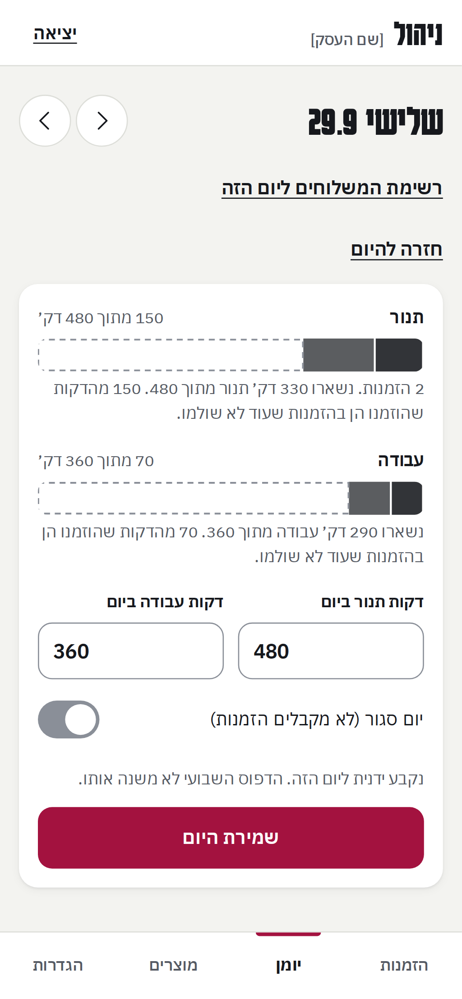

טוב לדעת:

- **יום סגור**: מדליקים את המתג "יום סגור (לא מקבלים הזמנות)". הזמנות שכבר יש ביום הזה לא מתבטלות.
- אי אפשר לרדת מתחת למה שכבר הוזמן. אם תנסי, האתר יגיד כמה כבר הוזמן.
- יום ששינית ביד נשאר כמו שקבעת, גם אם תשני אחר כך את השבוע הרגיל. כדי להחזיר אותו לשבוע הרגיל לוחצים **חזרה לדפוס השבועי**.

## 4. השבוע הרגיל שלי

כדי לא להקליד כל יום מחדש, קובעים פעם אחת שבוע רגיל. גוללים בלשונית **יומן** עד **דפוס שבועי**.

1. לכל יום בשבוע מסמנים אם הוא **יום עבודה**.
2. בימי העבודה מקלידים דקות תנור ודקות עבודה.
3. לוחצים **שמירת הדפוס השבועי**.

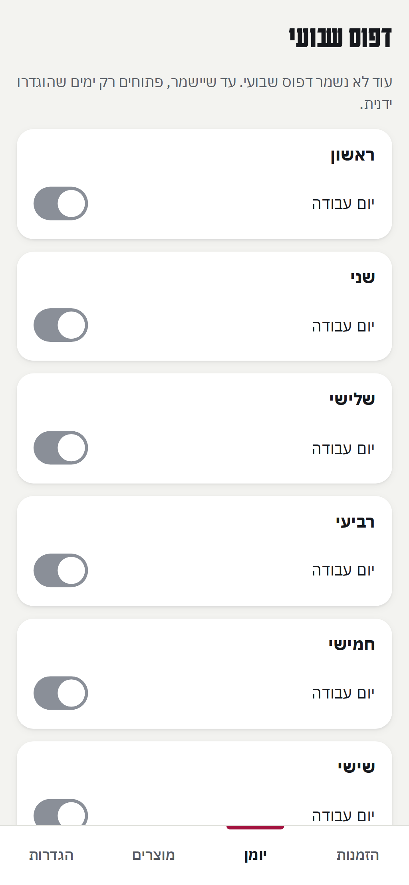

האתר ממלא לפי זה את הימים הקרובים. ימים ששינית ביד, וימים שכבר יש בהם יותר הזמנות ממה שהקלדת, לא משתנים. אחרי השמירה כתוב כמה ימים עודכנו.

## 5. הזמנות: התשלום הגיע, והודעה בוואטסאפ

בלשונית **הזמנות** רואים את ההזמנות לפי מצב: **ממתינות לתשלום**, **שולמו**, **נמסרו**, **פג תוקף**, **בוטלו**.

בכל הזמנה רואים את מספר ההזמנה, היום, מה הוזמן, הסכום והטלפון.

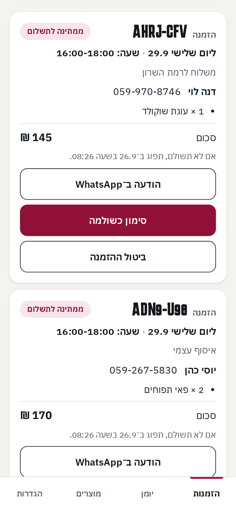

**כשהתשלום הגיע:**

1. בודקים בביט או בפייבוקס שהסכום הגיע, ושבהערה כתוב מספר ההזמנה.
2. לוחצים **סימון כשולמה**.
3. האתר מראה שוב את הסכום שצריך להגיע. אם הוא נכון, לוחצים **כן, התשלום הגיע**.

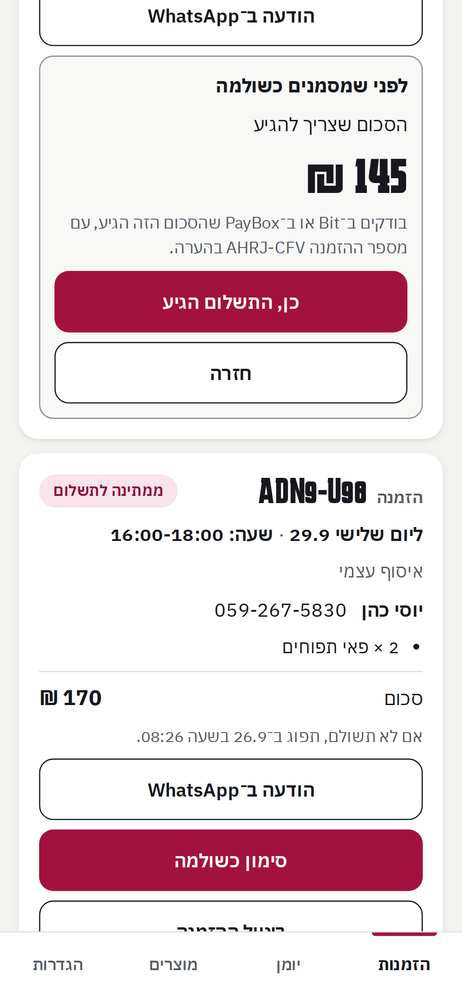 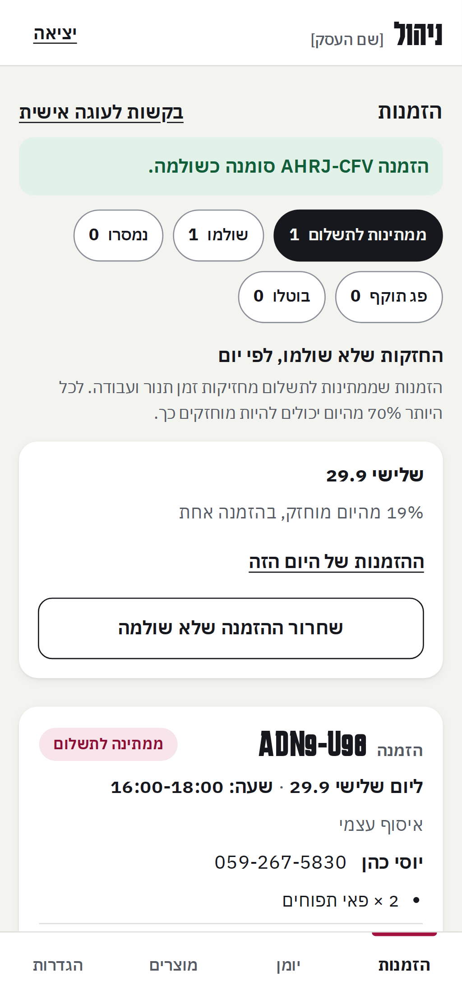

**הודעה ללקוח בוואטסאפ:**

לוחצים **הודעה ב־WhatsApp** בכרטיס ההזמנה. וואטסאפ נפתח עם הודעה מוכנה ללקוח, לפי מצב ההזמנה (למשל "התשלום התקבל, תודה"). קוראים, אפשר לשנות, ושולחים. האתר לא שולח לבד.

טוב לדעת:

- הזמנה שלא שולמה בזמן **פגה לבד**, והזמן שלה חוזר ללקוחות אחרים. בכרטיס כתוב עד מתי צריך לשלם.
- אם הזמנה פגה ובכל זאת הגיע עליה תשלום, יוצרים קשר עם הלקוח. האתר לא פותח מחדש הזמנה שפגה.
- **ביטול ההזמנה** מחזיר את הזמן שלה ללקוחות אחרים. אם היא כבר שולמה, את הכסף מחזירים מחוץ לאתר.
- כשהלקוח קיבל את ההזמנה לוחצים **נמסרה או נאספה**. בהזמנה בלי אימייל הכפתור עוד חסום: קודם הלקוח צריך לקבל אישור הזמנה בכתב, והאפשרות לסמן שהוא נשלח תגיע בגרסה הבאה.

## 6. בקשה לעוגה בעיצוב אישי

לקוחות יכולים לבקש עוגה מיוחדת: הם כותבים מה הם רוצים, לאיזה יום, ולפעמים מצרפים תמונות. בלשונית **הזמנות** לוחצים **בקשות לעוגה אישית**.

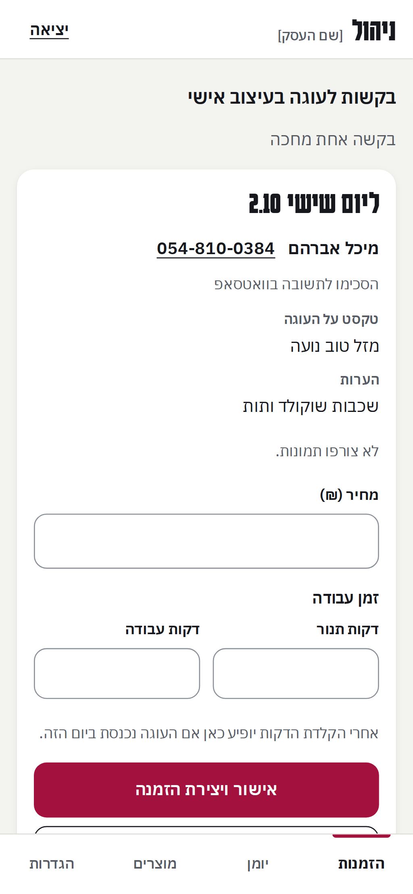

**כדי לאשר:**

1. מקלידים **מחיר**, **דקות תנור** ו**דקות עבודה**.
2. האתר בודק מיד אם העוגה נכנסת ביום הזה, וכותב "נכנס" או "לא נכנס".
3. לוחצים **אישור ויצירת הזמנה**.
4. לוחצים **שליחה בוואטסאפ**. ללקוח נשלחת הודעה עם המחיר, מספר ההזמנה וקישור לתשלום.

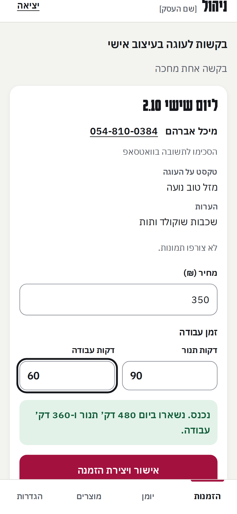 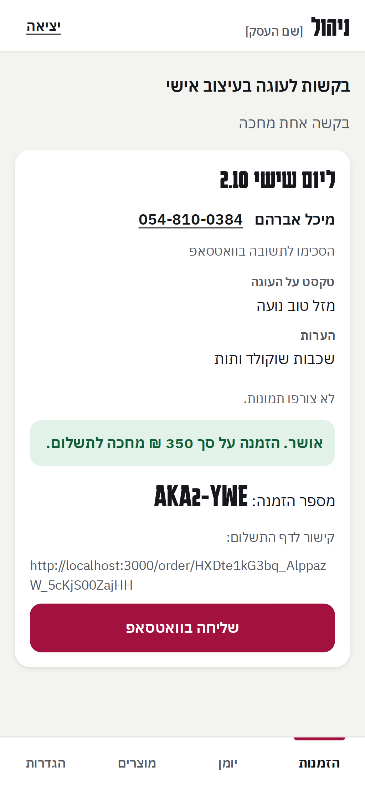

**אם העוגה לא נכנסת:** אפשר להוריד דקות, להוסיף זמן לאותו יום בלשונית **יומן**, או לתאם עם הלקוח יום אחר.

**כדי לדחות:** לוחצים **דחייה**. אפשר לכתוב סיבה, והלקוח יראה אותה בהודעת הוואטסאפ.

## 7. רשימת המשלוחים והדפסה שלה

בלשונית **יומן**, ביום הרצוי, לוחצים **רשימת המשלוחים ליום הזה**.

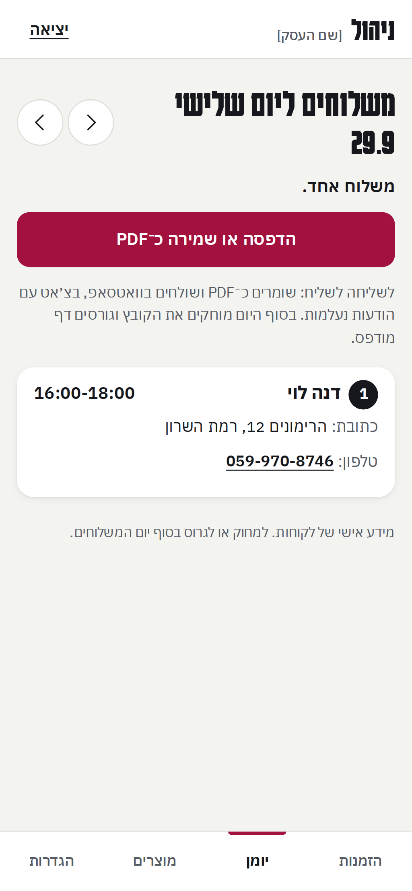

- ברשימה מופיעים רק משלוחים **ששולמו**. אם יש עוד משלוחים שמחכים לתשלום, כתוב כמה, בלי השמות.
- לוחצים **הדפסה או שמירה כ־PDF**. בטלפון נפתח חלון הדפסה, ושם אפשר לשמור קובץ.
- את הקובץ שולחים לשליח בוואטסאפ, בצ׳אט עם הודעות נעלמות.
- בסוף היום מוחקים את הקובץ וגורסים דף מודפס. יש בו פרטים אישיים של לקוחות.

## 8. כשמשהו לא עובד

- **"החיבור הסתיים. צריך להיכנס שוב."**: נכנסים שוב עם הסיסמה והקוד.
- **"הקוד שגוי או שפג תוקפו"**: מחכים שהמספר באפליקציה יתחלף ומקלידים את החדש.
- **"יותר מדי ניסיונות"**: מחכים 15 דקות ומנסים שוב.
- **הזמנה לא זזה למצב שביקשת**: אולי היא כבר השתנתה (למשל פגה). הרשימה מתעדכנת, וכתוב בה במה היא עכשיו.
- **כל דבר אחר**: מצלמים את המסך ושולחים לרן.

